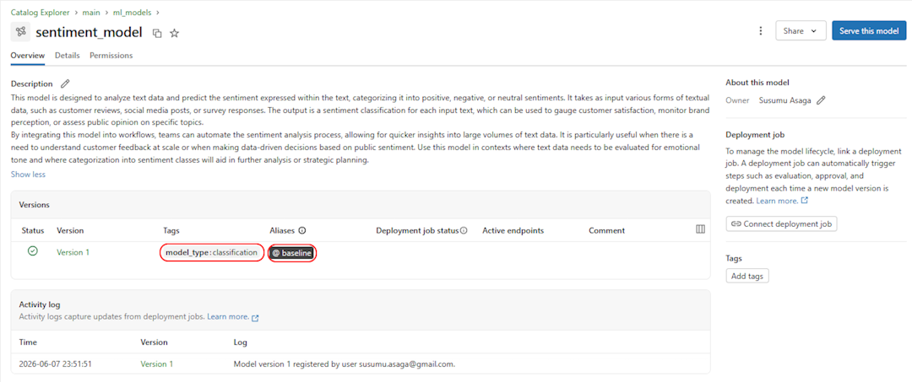

# Pickle-Free Legacy Model Migration to Databricks: A Production Pattern That Works

Edson Susumu Asaga  
[susumu.asaga@gmail.com](mailto:susumu.asaga@gmail.com)  
[LinkedIn article](https://www.linkedin.com/pulse/pickle-free-legacy-model-migration-databricks-production-susumu-asaga-of3qf/)

## TL;DR

A legacy model does not need to be retrained before it can become a governed, scalable Databricks production asset.

This article shows a practical migration pattern for non-standard models when the original training pipeline is gone or too risky to reproduce:

- Extract the trained parameters from the legacy environment.
- Store those parameters in pickle-free, data-only files such as NumPy and JSON.
- Keep the inference algorithm as plain Python code using MLflow's "model from code" style.
- Validate prediction parity before leaving the legacy environment.
- Package both pieces with an MLflow `pyfunc` model.
- Register the model in Databricks Unity Catalog.
- Run production inference at scale with Spark UDFs.

The key idea is a hybrid packaging approach: **model code stays readable, model state stays portable, and Databricks provides the production control plane.**

---

## The Migration Problem Nobody Gets to Avoid

Sooner or later, a useful machine learning model outlives the system that trained it.

The model may still be valuable. It may be validated, monitored, trusted by the business, and embedded in a real workflow. But the surrounding environment is no longer production-grade:

- the training pipeline is unavailable or no longer reproducible;
- the original runtime uses outdated dependencies;
- the model was built outside standard ML platform conventions;
- retraining would change model behavior and trigger a new validation cycle;
- the organization now wants governance, lineage, and scalable inference on Databricks.

That is the uncomfortable but common migration scenario: **you need to modernize the deployment without changing the model.**

This article demonstrates how to migrate a non-standard legacy model to Databricks without retraining and without relying on `pickle` or `cloudpickle` for the model's trained state.

All code used in this article is available in [my public repository](https://github.com/susumuasaga/ml_model_migration_databricks).

---

## The Packaging Strategy

MLflow gives us a standard interface for deploying custom models through `pyfunc`. It also supports a newer "model from code" style, where the model behavior is stored as Python source rather than as a serialized Python object.

Both ideas are useful, but neither is sufficient by itself for many legacy migrations.

The classic custom-model approach often serializes a Python object with `pickle` or `cloudpickle`. That can work, but it couples the artifact to implementation details of the original Python environment. For long-lived production models, this creates avoidable risk:

- binary artifacts are difficult to inspect;
- deserialization can depend on Python and package versions;
- security reviews may object to executable object deserialization;
- debugging a broken load path can be painful;
- portability across Databricks runtimes is weaker than it needs to be.

The pure "model from code" approach makes the inference logic readable and maintainable. However, if the model has trained parameters, hardcoding those parameters into Python source is a bad trade. It makes the code brittle and turns every parameter update into a code change.

The pattern used here is hybrid:

1. **Save trained state as data.** Use transparent formats such as `.npz`, `.npy`, JSON, CSV, Parquet, or other domain-appropriate non-pickle files.
2. **Save inference behavior as code.** Keep preprocessing, validation, scoring, and output contracts in plain Python.
3. **Bind them with MLflow.** Use `PythonModel.load_context` to load the data artifacts when the model is loaded.
4. **Deploy through Databricks.** Register the model in Unity Catalog and use Databricks compute for governed, scalable inference.

In short:

> A production model artifact should be easy to load, easy to inspect, easy to govern, and hard to accidentally mutate.

---

## Migration Flow

The migration has two clear execution environments. In the legacy environment, the work is to reconstruct the inference contract, export trained state into pickle-free artifacts, and prove prediction parity before anything is promoted. In the Databricks environment, the work is to package, govern, and scale the model.


The diagram is intentionally artifact-centered. The model becomes portable only when the trained state and inference code can move together without carrying the original runtime with them.

---

## Example Scenario

To make the approach concrete, this project uses a simple binary sentiment classifier for Amazon food reviews.

The dataset comes from the MIT MicroMasters in Statistics and Data Science. Each review is labeled as:

- `+1` for positive sentiment;
- `-1` for negative sentiment.

Example:

| review | label |
| ------ | ----- |
| Nasty No flavor. The candy is just red, No flavor. Just plain and chewy. I would never buy them again | -1 |
| YUMMY! You would never guess that they're sugar-free and it's so great that you can eat them pretty much guilt free! i was so impressed that i've ordered some for myself (w dark chocolate) to take to the office. These are just EXCELLENT! | +1 |

For the migration exercise, assume the model was trained elsewhere and the training pipeline is no longer available. The only trusted assets are the trained parameters:

- `theta`, the linear model weights;
- `theta_0`, the intercept;
- `dictionary`, the word-to-index mapping used by the bag-of-words vectorizer.

The goal is not to improve accuracy. The goal is to preserve the model's behavior while moving it into a modern Databricks production workflow.

---

## Legacy Environment - Step 1: Rebuild the Inference Contract

The custom model below extends `mlflow.pyfunc.PythonModel`.

It owns three production responsibilities:

- load the exported trained state;
- reproduce the original feature transformation;
- expose a stable prediction interface.

```python
import os
import json
import string
from typing import Any, override

import numpy as np
import mlflow
import pandas as pd


class SentimentModel(mlflow.pyfunc.PythonModel):
    """
    MLflow pyfunc model for sentiment classification.

    This model reconstructs a legacy linear classifier using:
        - Bag-of-Words feature extraction
        - Pre-trained parameters (theta, theta_0)

    The model is self-contained and does not depend on the
    original training environment.
    """

    def __init__(self, theta=None, theta_0=None, dictionary=None):
        super().__init__()
        self.theta = theta
        self.theta_0 = theta_0
        self.dictionary = dictionary

    def save_artifact(self, path):
        """
        Save a trained model as a portable artifact.

        Args:
            path (str | Path): Directory where the artifact will be stored.

        The artifact structure:
            - model.npz: numerical parameters
            - dictionary.json: word-to-index mapping
        """
        os.makedirs(path, exist_ok=True)

        np.savez(
            os.path.join(path, "model.npz"),
            theta=self.theta,
            theta_0=self.theta_0,
        )

        with open(os.path.join(path, "dictionary.json"), "w") as f:
            json.dump(self.dictionary, f)

    @override
    def load_context(self, context):
        """
        Load model artifacts into memory.

        Args:
            context: MLflow context containing the model artifact paths.
        """
        path = context.artifacts["weights"]

        data = np.load(path)
        self.theta = data["theta"]
        self.theta_0 = float(data["theta_0"])

        path = context.artifacts["dictionary"]
        with open(path) as f:
            self.dictionary = json.load(f)

    def vectorize(self, texts: pd.Series):
        """
        Convert raw text into Bag-of-Words feature vectors.

        Args:
            texts (pd.Series): Input text samples.

        Returns:
            np.ndarray: Feature matrix of shape (n_samples, vocab_size).
        """
        vocab_size = len(self.dictionary)
        X = np.zeros((len(texts), vocab_size))

        punctuation_map = str.maketrans(
            {ch: f" {ch} " for ch in string.punctuation + string.digits}
        )

        for i, text in enumerate(texts):
            tokens = text.lower().translate(punctuation_map).split()
            for word in tokens:
                if word in self.dictionary:
                    idx = self.dictionary[word]
                    X[i, idx] = 1

        return X

    @override
    def predict(
        self,
        context,
        model_input: pd.DataFrame,
        params: dict[str, Any] | None = None,
    ):
        """
        Generate predictions from raw text input.

        Args:
            context: MLflow context (unused during inference).
            model_input: DataFrame with a single text column named "text".
            params: Optional dictionary of parameters (unused).

        Returns:
            A numpy array of predicted confidence scores.
        """
        if not isinstance(model_input, pd.DataFrame) or list(model_input.columns) != [
            "text"
        ]:
            raise TypeError(
                'model_input must be a pandas DataFrame with one column named "text".'
            )

        X = self.vectorize(model_input["text"])

        scores = X @ self.theta + self.theta_0
        return scores


mlflow.models.set_model(SentimentModel())
```

The important production detail is in `load_context`. MLflow provides local paths to the registered artifacts, and the model reconstructs its runtime state from those files.

This keeps the implementation clean:

- the model algorithm is versioned as source code;
- trained state is versioned as data;
- the prediction API is standardized through MLflow.

---

## Legacy Environment - Step 2: Convert Legacy State into Pickle-Free Artifacts

After the inference contract is explicit, export only the model's trained state from the legacy environment.

Instead of serializing the full Python object, write the state into transparent data formats:

- numerical parameters go into a NumPy `.npz` file;
- the vocabulary dictionary goes into JSON.

```python
from model import SentimentModel

# theta, theta_0, and dictionary are the trained parameters from the legacy model.
model = SentimentModel(theta=theta, theta_0=theta_0, dictionary=dictionary)
model.save_artifact("model_artifact")
```

That creates a portable artifact directory:

```text
model_artifact
|-- dictionary.json
`-- model.npz
```

This is a deliberate boundary. The legacy environment is used to extract stable model state and verify behavior before the model is moved to Databricks.

---

## Legacy Environment - Step 3: Validate Prediction Parity

Parity validation is the final task before leaving the legacy environment. It proves that the migrated inference contract reproduces the legacy model's behavior on a fixed validation set.

Use a representative sample that covers common cases, edge cases, malformed input if the production contract allows it, and any examples already used in business validation. Compare raw scores, not only labels, because labels can hide small numerical differences.

In this example, the legacy implementation exposes a `decision_function`, while the migrated implementation exposes the MLflow `PythonModel.predict` contract. Both should produce the same score for the same input text.

```python
from types import SimpleNamespace

import numpy as np
import pandas as pd

import project1 as p1  # Legacy model module.
from model import SentimentModel

# theta, theta_0, and dictionary are the trained parameters extracted
# from the legacy model.

# reviews_test.tsv contains a fixed validation dataset with 500 samples.
test_pd = pd.read_csv("data/reviews_test.tsv", sep="\t", encoding="windows-1252")

legacy_scores = p1.decision_function(
    test_pd["text"],
    theta=theta,
    theta_0=theta_0,
    dictionary=dictionary,
)

artifact_dir = "model_artifact"
context = SimpleNamespace(
    artifacts={
        "weights": f"{artifact_dir}/model.npz",
        "dictionary": f"{artifact_dir}/dictionary.json",
    }
)
migrated_model = SentimentModel()
migrated_model.load_context(context)
migrated_scores = migrated_model.predict(context, test_pd[["text"]])

np.testing.assert_allclose(
    migrated_scores,
    legacy_scores,
    rtol=1e-10,
    atol=1e-12,
)
```

For production migrations, save the parity report as release evidence. At minimum, record:

- validation dataset path and checksum;
- legacy runtime version or container image;
- exported artifact checksums;
- number of compared records;
- score tolerance;
- maximum absolute difference;
- maximum relative difference;
- pass or fail result.

Only after this check passes should the artifact bundle move to Databricks.

---

## Databricks Environment - Step 4: Save the Model with MLflow

After parity validation passes and the artifact bundle is exported to Databricks, package the model with MLflow.

The `artifacts` dictionary is not optional here. It maps names used by `load_context` to the files MLflow should package with the model.

```python
import pandas as pd

artifact_dir = "../model_artifact"
artifacts = {
    "weights": f"{artifact_dir}/model.npz",
    "dictionary": f"{artifact_dir}/dictionary.json",
}

input_example = pd.DataFrame({
    "text": [("Nasty No flavor. The candy is just red, No flavor."
              " Just plain and chewy. I would never buy them again")]
})
```

For Databricks Unity Catalog, include a model signature. Providing an `input_example` lets MLflow infer the signature during model saving or logging.

```python
import mlflow.pyfunc

pyfunc_path = "../sentiment_model"

mlflow.pyfunc.save_model(
    pyfunc_path,
    python_model="../model/sentiment_model.py",
    artifacts=artifacts,
    input_example=input_example,
)
```

Now load the model locally to validate the package before registering it:

```python
loaded_model = mlflow.pyfunc.load_model(pyfunc_path)
loaded_model.predict(input_example)
```

```text
array([-0.43897545])
```

At this point, the migration has a crucial property: the model can be loaded and scored outside the original legacy environment.

---

## Databricks Environment - Step 5: Register the Model in Unity Catalog

Databricks adds the production control plane around the MLflow model: centralized governance, versioning, access control, lineage, and cross-workspace model discovery through Unity Catalog.

Set the MLflow registry URI to Unity Catalog:

```python
import mlflow

mlflow.set_registry_uri("databricks-uc")
```

Register the packaged model:

```python
model_name = "main.ml_models.sentiment_model"

mlflow.register_model(pyfunc_path, model_name)
```

Example output:

```text
<ModelVersion: aliases=[], creation_timestamp=1780887111107, current_stage=None, deployment_job_state=<ModelVersionDeploymentJobState: current_task_name='', job_id='', job_state='DEPLOYMENT_JOB_CONNECTION_STATE_UNSPECIFIED', run_id='', run_state='DEPLOYMENT_JOB_RUN_STATE_UNSPECIFIED'>, description='', last_updated_timestamp=1780887125115, metrics=[], model_id='', name='main.ml_models.sentiment_model', params=[], run_id='', run_link=None, source='sentiment_model', status='READY', status_message='', tags={}, user_id='susumu.asaga@gmail.com', version='1', workspace='default'>
```

In Unity Catalog Explorer, the model version can be documented, tagged, and assigned aliases for downstream use.



Aliases are especially useful for production deployments. Instead of hardcoding a numeric version, production inference can load a stable alias such as `baseline` or `production_model`.

```python
model_uri = f"models:/{model_name}@baseline"
model = mlflow.pyfunc.load_model(model_uri)
```

Validate the registered model:

```python
model.predict(input_example)
```

```text
array([-0.43897545])
```

The same score confirms that the model package, registry load path, and artifact loading behavior are aligned.

---

## What MLflow Saved

The saved MLflow model is a portable directory containing metadata, environment specifications, source code, examples, and the non-pickle model artifacts:

```text
sentiment_model
|-- MLmodel
|-- conda.yaml
|-- input_example.json
|-- python_env.yaml
|-- requirements.txt
|-- sentiment_model.py
|-- serving_input_example.json
`-- artifacts
    |-- dictionary.json
    `-- model.npz
```

This structure is one of the reasons MLflow is effective for legacy migrations. The deployment artifact is no longer a mysterious binary object. It has inspectable metadata, explicit dependencies, readable inference code, and data-only trained parameters.

---

## Databricks Environment - Step 6: Run Distributed Inference with Spark UDFs

Once the model is registered in Unity Catalog, Databricks can apply it to distributed data with `mlflow.pyfunc.spark_udf`.

This is useful when the model itself is not a distributed algorithm, but the inference workload is large. Spark distributes the rows; MLflow handles model loading on the workers.

The sample dataset contains:

- `reviews_train.tsv` with 4,000 examples;
- `reviews_validation.tsv` with 500 examples;
- `reviews_test.tsv` with 500 examples.

For this example, place the files in a Unity Catalog volume:

```text
/Volumes/workspace/ml_model_migration/review_data/
```

Read the test set:

```python
test_df = (
    spark.read.format("csv")
    .option("sep", "\t")
    .option("header", "true")
    .option("inferSchema", "true")
    .load("/Volumes/workspace/ml_model_migration/review_data/reviews_test.tsv")
)
test_df.select("sentiment", "summary", "text").show()
```

Example output:

```text
+---------+--------------------+--------------------+
|sentiment|             summary|                text|
+---------+--------------------+--------------------+
|        1|       Smooth coffee|"My built-in Bosc...|
|        1|             awesome|"An absolute ""mu...|
|        1|Great treat for b...|I have a Great Da...|
|       -1|Disappointing - m...|I got turned on t...|
|        1|      Good Product !|I enjoyed the pro...|
|       -1|         Not so good|After doing numer...|
|        1|  good-tasting snack|The texture of th...|
|       -1|Using because Dr ...|I'm drinking oolo...|
|       -1|        Not so great|This dip mix is t...|
|        1|         Delicious!!|I love this amazi...|
+---------+--------------------+--------------------+
only showing top 10 rows
```

Create a Spark UDF from the registered model and apply it to the review text:

```python
import pyspark.sql.functions as F
import mlflow.pyfunc

predict_udf = mlflow.pyfunc.spark_udf(spark, model_uri, result_type="double")

pred_df = test_df.withColumn("prediction", predict_udf(F.struct("text")))

pred_df.select("sentiment", "prediction", "summary", "text").show()

table_name = "workspace.ml_model_migration.udf_predictions"
pred_df.write.format("delta").mode("overwrite").saveAsTable(table_name)
```

Example output:

```text
+---------+--------------------+--------------------+--------------------+
|sentiment|          prediction|             summary|                text|
+---------+--------------------+--------------------+--------------------+
|        1|  1.2734357509323815|       Smooth coffee|"My built-in Bosc...|
|        1|  0.2674862142200569|             awesome|"An absolute ""mu...|
|        1|   2.093886961957004|Great treat for b...|I have a Great Da...|
|       -1|-0.37306337766955794|Disappointing - m...|I got turned on t...|
|        1| -0.5583418656478801|      Good Product !|I enjoyed the pro...|
|       -1|-0.19818154992196502|         Not so good|After doing numer...|
|        1| -0.2591099137128384|  good-tasting snack|The texture of th...|
|       -1|-0.31400168428513026|Using because Dr ...|I'm drinking oolo...|
|       -1| -0.6192343836409172|        Not so great|This dip mix is t...|
|        1|   1.740617005515641|         Delicious!!|I love this amazi...|
+---------+--------------------+--------------------+--------------------+
only showing top 10 rows
```

The model is still the same legacy classifier. The difference is that it now runs through Databricks-native production infrastructure.

---

## Production Checklist

For a real migration, I would treat the following items as mandatory before release:

- **Prediction parity:** compare scores from the legacy runtime and the migrated package on a fixed validation set before exporting to Databricks.
- **Schema contract:** validate input column names, types, null handling, and output type.
- **Artifact review:** inspect every file packaged with the model and remove unnecessary legacy dependencies.
- **Environment pinning:** keep `requirements.txt`, `conda.yaml`, or the Databricks runtime policy explicit.
- **Unity Catalog governance:** use a catalog, schema, permissions, tags, descriptions, and aliases intentionally.
- **Deployment aliasing:** point production workloads to an alias, not a hardcoded model version.
- **Batch output lineage:** write predictions to Delta tables with enough metadata to reproduce each scoring run.
- **Operational monitoring:** track row counts, error rates, score distributions, and data drift where appropriate.

This is where Databricks Data Engineering practice matters. A successful migration is not only a model packaging exercise. It is also a data contract, governance, deployment, and observability exercise.

---

## Key Takeaways

- Legacy model migration is usually about **portability and governance**, not immediate retraining.
- Avoiding `pickle` for trained state makes model artifacts easier to inspect, review, and move across runtimes.
- A hybrid package keeps **parameters as data** and **inference as code**.
- MLflow `pyfunc` provides the serving interface for non-standard models.
- Unity Catalog provides governed registration, versioning, and aliases.
- Spark UDFs let Databricks scale inference over large datasets without rewriting the model as a distributed algorithm.

---

## Final Thought

Legacy models are often treated as technical debt because they are hard to move.

But when you separate trained state from inference logic, package the result with MLflow, and operate it through Databricks, the same model becomes something much more useful:

> a portable, governed, production-ready data product.
